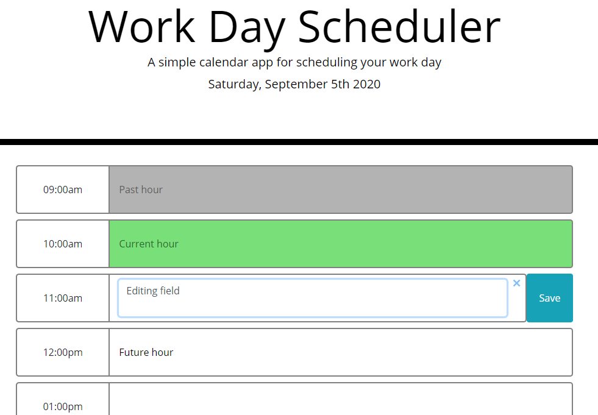

# Work Day Scheduler

Link: https://meemofu.github.io/work-scheduler/

## Preview:

## Features:

1. Automatically update every 5 mins

2. By default, the fields occupy the whole page

3. When clicked on, the selected field will enter edit mode and reveal buttons to either save or clear the fields (multiple fields can enter edit mode at the same time)

4. The fields will only be save if one of the button is pressed

5. Once saved, the fields will remain when reload